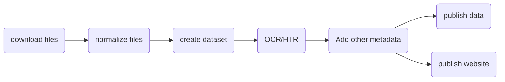
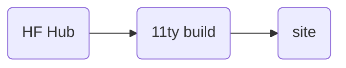

# Workflow 

## Import 

    <b>Download</b>
    <ul><li>Configure project, update settings.yml</li>
    <li>Download all Drive folders and files to local folders</li></ul>
    <b>Normalize</b>
    <ul><li>Complete normalization of filenames</li> 
    <li>Complete normalization of file types</li>
    <li>Re-size large files, optimize for web</li>
    </ul>
    <b>Datafy</b>
    <ul><li>Create dataset</li> 
    <li>Create a metadata record for each file</li> 
    <li>Populate with OCRd text, labels and other metadata</li>
    <li>Evaluate license and copyright</li> 
    <b>Deploy</b>
    <ul>
        <li>Push dataset to Huggingface Hub</li>
        <li>Publish content to the Web</li>
    </ul>
    
    
    

<hr>

## Export 

[@hugginface/hub](https://huggingface.co/docs/huggingface.js/index)


HF Hub
- supports data publication
- versioning 
- documentation 
- uses git to differing copies 
- advantages of managed cloud db w/o cost


## Example process 

Download from Drive 
```bash
lenticular drive-download 1R8JA-C_QxSdekKfRfetj5j4fbjFXJu6G
```

Download from Box
```bash
lenticular box-download 173302952002
```

Normalize files
```bash
lenticular normalize
```
Create or update a dataset from files
```bash
lenticular dataset
```

Add OCR text using Vision
```bash
lenticular process
```

Push updated files and data to Huggingface Hub
```bash
lenticular dataset
```

