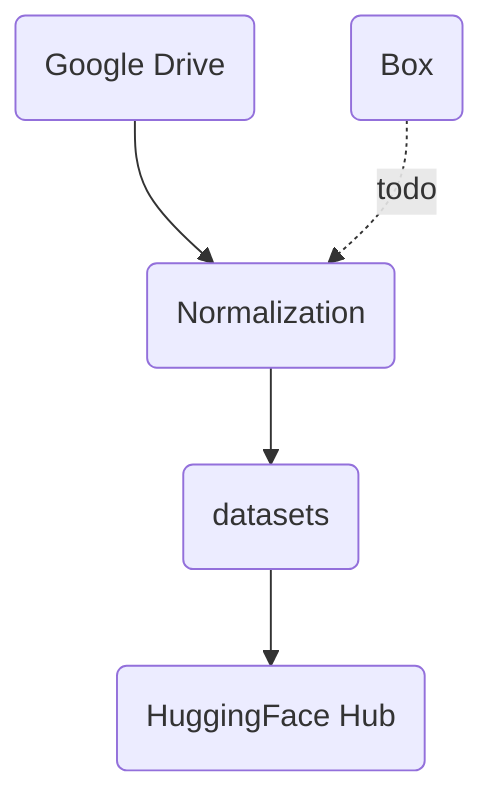
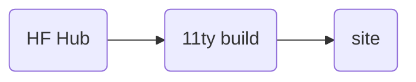

# Workflow 

## Import 

    

    

    

    <b>Download</b>
    <ul><li>Configure project, update settings.yml</li>
    <li>Download all Drive folders and files to local folders</li></ul>
    <b>Normalization</b>
    <ul><li>Complete normalization of filenames</li> 
    <li>Complete normalization of file types</li>
    <li>Re-size large files, optimize for web</li>
    <li>Clean spreadsheets with openrefine</li> </ul>
    <b>Datafication</b>
    <ul><li>Create dataset</li> 
    <li>Create a metadata record for each file</li> 
    <li>Populate with OCRd text, labels and other metadata</li>
    <li>Evaluate license and copyright</li> 
    <b>Deploy</b>
    <ul><li>Push dataset to Huggingface Hub</li></ul>
    
    
    
    

## Export 

[@hugginface/hub](https://huggingface.co/docs/huggingface.js/index)

Requirements 

Partner shares materials from Drive 
Partners can edit and update data in Drive
We should work with partners to normalize data (either in Drive or after download?)
- partners clean and check by hand
- we can clean and check automatically (change filenames)

I am not sure that I should add sync. 
1. No sync. We fetch all project assets.
- we then manage them in a new enviornment
- partners need to learn this new enviornment 
- we are able to clean and process materials, save them to a proper dataset 

2. Sync. We fetch and update from the cloud
- partners maintain in familiar env
- we'd need to clean and process materials in the cloud

3. Two sets. We fetch from the cloud, clean, then push cleaned new version back to cloud, run sync on new version.
- presumes need to track updates (how often will it change?)
- partners maintain in familiar env
- we don't have to pay for storage (new version acts as data store)
- people will continue to add stuff, and they'll add it where they know

HF Hub
- supports data publication
- versioning 
- documentation 
- uses git to differing copies 
- advantages of managed cloud db w/o cost