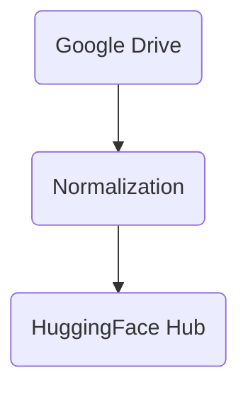

# Workflow 

I am not sure that I should add sync. 
1. No sync. We fetch all project assets.
- we then manage them in a new enviornment
- partners need to learn this new enviornment 
- we are able to clean and process materials, save them to a proper dataset 

2. Sync. We fetch and update from the cloud
- partners maintain in familiar env
- we'd need to clean and process materials in the cloud

3. Two sets. We fetch from the cloud, clean, then push cleaned new version back to cloud, run sync on new version.
- presumes need to track updates (how often will it change?)
- partners maintain in familiar env
- we don't have to pay for storage (new version acts as data store)
- people will continue to add stuff, and they'll add it where they know
